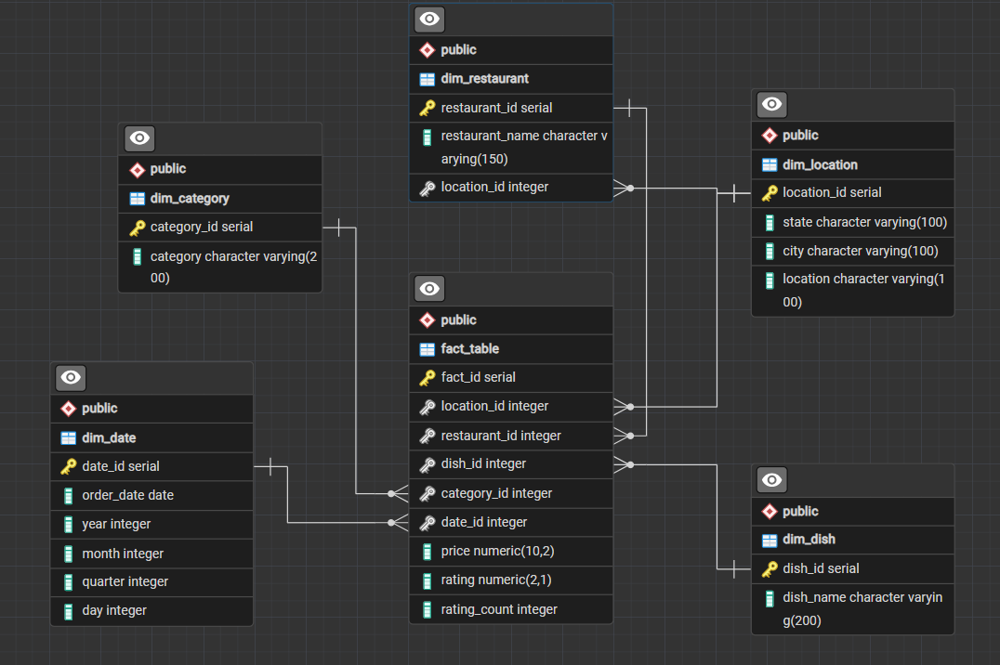

# 🍔 Swiggy Business Analysis using SQL (PostgreSQL)


---

# 📌 Project Overview

This project performs end-to-end business analysis on Swiggy's restaurant and menu dataset using PostgreSQL.

The objective of this project is to extract meaningful business insights related to:

- Restaurant performance
- Customer ratings
- Menu pricing strategies
- Category analysis
- Time-based trends
- Value-for-money categories
- Restaurant and location insights

The project follows a **Star Schema Data Warehouse approach** and solves real-world business problems using advanced SQL techniques.

---

# 🛠️ Tech Stack

- PostgreSQL
- SQL
- pgAdmin 4
- Git & GitHub

---

# 🏗️ Database Design

The project follows a **Star Schema** approach.

## ⭐ Star Schema (ERD)



## Raw Data Layer
- `swiggy_data`

## Fact Table
- `fact_table`

## Dimension Tables
- `dim_restaurant`
- `dim_location`
- `dim_category`
- `dim_dish`
- `dim_date`

---

# 📊 Data Quality Checks Performed

- NULL Value Analysis
- Blank Value Analysis
- Duplicate Detection
- Data Validation
- Data Transformation
- Star Schema Modeling

---

# 🎯 SQL Concepts Used

- Joins
- Join Cardinality
- Aggregate Functions
- GROUP BY & HAVING
- Common Table Expressions (CTEs)
- Subqueries
- CASE WHEN
- Window Functions
- ROW_NUMBER()
- RANK()
- DENSE_RANK()
- LAG()
- LEAD()
- Time Intelligence Analysis
- Business KPI Analysis

---

# 📈 Business Problems Solved

- Performed data quality checks and exploratory analysis.
- Analyzed restaurant performance and customer ratings.
- Identified top-performing restaurants and restaurant brands.
- Conducted monthly and quarterly trend analysis.
- Ranked restaurants, dishes, and categories using window functions.
- Compared category prices using LAG() and LEAD().
- Segmented menu items into Budget, Mid-Range, and Premium categories.
- Identified top expensive menu items in each category.
- Discovered categories performing above overall averages.
- Identified value-for-money categories having high ratings and lower average prices.

---

# 📂 Repository Structure

```text
swiggy-business-analysis-sql/
│
├── README.md
├── Swiggy_Analysis.sql
│
├── schema/
│   └── star_schema.png
│
├── screenshots/
│   ├── er_diagram.png
│   ├── top_restaurants.png
│   ├── window_functions.png
│   └── value_for_money.png
│
└── docs/
    └── project_report.pdf
```

---

# 📸 Project Screenshots

### Star Schema
(Add image here)

### Query Outputs
(Add screenshots here)

---

# 🚀 Key Skills Demonstrated

- SQL
- PostgreSQL
- Data Analysis
- Business Intelligence
- Data Modeling
- Data Cleaning
- Problem Solving
- Analytical Thinking

---

# 👨‍💻 Author

**Shubham**

B.Tech CSE | Aspiring Data Analyst

GitHub: [Shubham Singh](https://github.com/shubhamss02)

LinkedIn: [Shubham Singh](https://www.linkedin.com/in/shubham-singh-535274279/)

---

⭐ If you found this project useful, feel free to star the repository.
